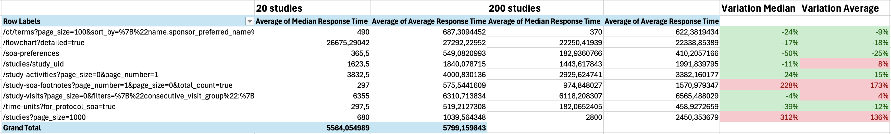

# openstudybuilder-load-test
Repository to hold load testing scripts for OpenStudyBuilder

## Protocol

* Run the [OpenStudyBuilder API](https://gitlab.com/Novo-Nordisk/nn-public/openstudybuilder/OpenStudyBuilder-Solution/-/tree/main/clinical-mdr-api)
* Create 20 Studies, using the [dummy data import script](https://gitlab.com/Novo-Nordisk/nn-public/openstudybuilder/OpenStudyBuilder-Solution/-/blob/main/studybuilder-import/importers/run_import_dummydata.py?ref_type=heads)
* Use Locust to have 20 concurrent users making API calls to complex endpoints (e.g. the endpoints called to generate a *Schedule of Activities*)
* Create 200 Studies
* Repeat

## Requirements

### Packages
You need to have the `locust` Python package installed ; you can use the Pipfile for this :

```python
pipenv install
```

### Dependencies
You need to have the following components set-up and running:
* Neo4j database, loaded with initial data. You can use the [default OpenStudyBuilder Docker compose](https://gitlab.com/Novo-Nordisk/nn-public/openstudybuilder/OpenStudyBuilder-Solution/-/tree/main) for this. **Alternatively**, you can use the database dump provided in this repo, meant for Neo4j 5.25.1 and OSB 0.12 ; it contains 200 Studies already ;
* OpenStudyBuilder API (see above Docker compose, or the Protocol section) ;
* Once this is running, you can use the [dummy data import script from `studybuilder-import`](https://gitlab.com/Novo-Nordisk/nn-public/openstudybuilder/OpenStudyBuilder-Solution/-/blob/main/studybuilder-import), using `pipenv run import_dummydata --desperate --studies=50`
* Create a .env environment based on the [.env.example file](.env.example). Leave the `AUTH_TOKEN` empty by default.
* Once you have all the studies you want, run `locust` for a long enough time (we did 15 minutes for 20 Studies and 45 minutes for 200): 

```python
# This will start the locust web interface at http://localhost:8089/ on your machine.
# We provide default number of users and test duration but you can tweak it
pipenv run load-test-ui

# This will run the headless version and output result files
pipenv run load-test-cl
```

## Results

For 20 concurrent users, calling all the endpoints used to generate a Schedule of Activities, we compared the response times with 20 and 200 Studies.

It shows that response times do not grow exponentially when the number of Studies increases - it actually decreased for most of the endpoints, which is probably a side effect and shows the response time is mostly stable. Only the endpoints listing elements for all studies slow down, which makes sense.



You can find the detailed data in [this Excel file](results/soa_load_test.xlsx).